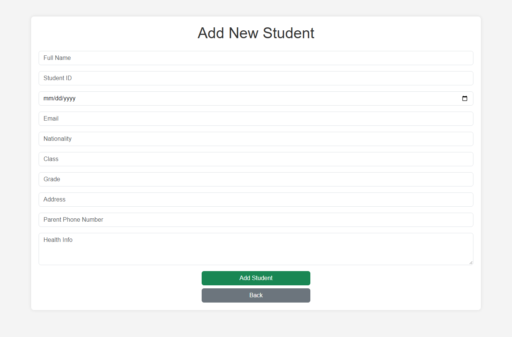
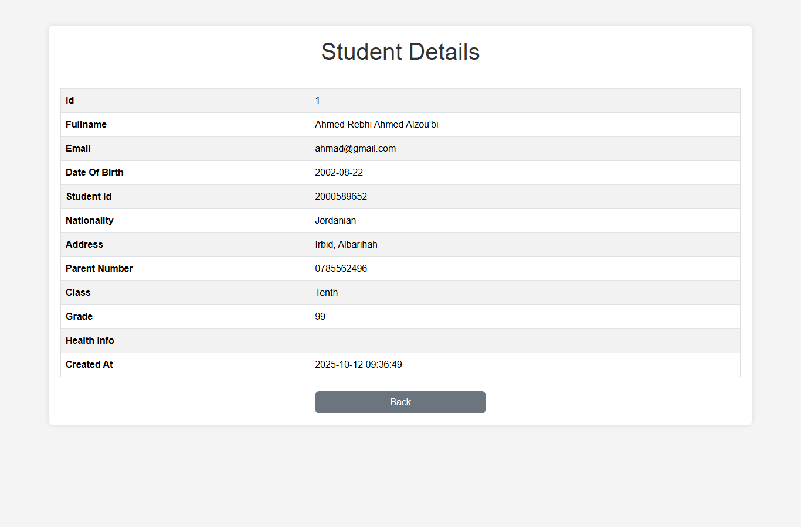

# Student Management System

Simple PHP + MySQL app to manage students. Built for XAMPP.

## What it does

- List, add, view, edit, delete students
- Live search and filter (AJAX)
- Export to CSV

## Tech

PHP 8, PDO, MySQL, Bootstrap 5, jQuery. No framework.

## Run it (XAMPP)

1. Copy the project to `C:\xampp\htdocs\Student-Management-System`
2. Start Apache + MySQL in XAMPP
3. Import `database.sql` with phpMyAdmin (creates `student_manager` + sample data)
4. Open `http://localhost/Student-Management-System/public/index.php`

DB login is in `app/models/Database.php` (default: `root` / no password).

## Files

```
app/controllers/StudentController.php
app/models/Database.php, Student.php
app/views/students/ (index, create, edit, show)
public/index.php (home page)
public/actions/ (search, delete, export)
database.sql
```

## Screenshots

| Home | Add |
|---|---|
|  |  |

| View | Edit |
|---|---|
|  |  |

## License

MIT.
