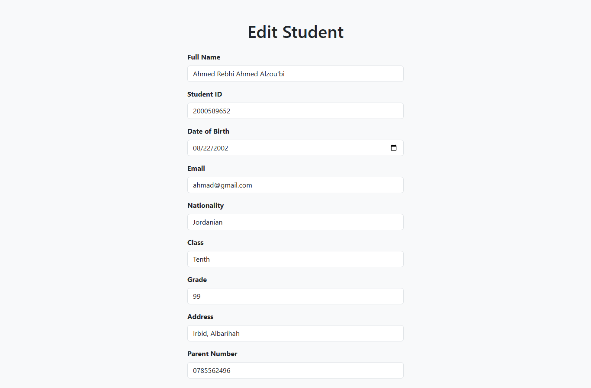

# Students Manager System

A simple PHP + MySQL web app for managing students records with full CRUD, live search, and CSV export, built for XAMPP.

## Screenshots

### Home


### Add Student


### Edit Student



## Features

- List all students in responsive table view
- Add new student with server-side validation
- View student details page
- Edit existing student records
- Delete student with confirmation
- Live search and filter with AJAX (no page reload)
- Export students list to CSV
- Form validation for required fields, email, and grade
- PDO prepared statements for secure database access
- Clean MVC-like separation (models, views, controllers)
- Responsive UI with custom CSS

## Technologies

- HTML
- CSS
- JavaScript
- PHP 8
- PDO
- MySQL
- Bootstrap 5
- jQuery

## Project Structure

```
app/
  controllers/
    StudentController.php
  models/
    Database.php
    Student.php
  views/
    students/
      index.php
      create.php
      edit.php
      show.php
public/
  index.php
  actions/
    search_student.php
    delete_student.php
    export_students.php
  assets/
    css/
      style.css
    js/
      script.js
database.sql
docs/
  screenshots/
README.md
```

## Installation

Clone the repository:

```bash
git clone https://github.com/Ahmed-Alzoubi-az9/Student-Management-System.git
```

Run the project using a local Apache environment such as XAMPP.

1. Copy the project to `C:\xampp\htdocs\Students_Manager_System`
2. Start Apache + MySQL in XAMPP
3. Import `database.sql` with phpMyAdmin (creates `student_manager` + sample data)
4. Open `public/index.php` via `http://localhost/Students_Manager_System/public/index.php`

DB login is in `app/models/Database.php` (default: `root` / no password).

## Notes

Note: This is a university training project. It was recreated for learning purposes and customized during training to practice PHP CRUD operations, PDO database handling, MVC-like structure, Bootstrap responsive layouts, AJAX live search, and basic frontend/backend integration.
